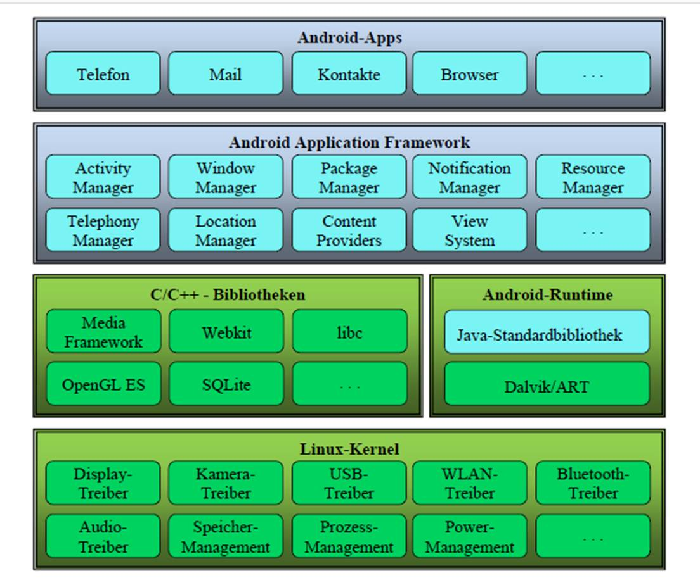
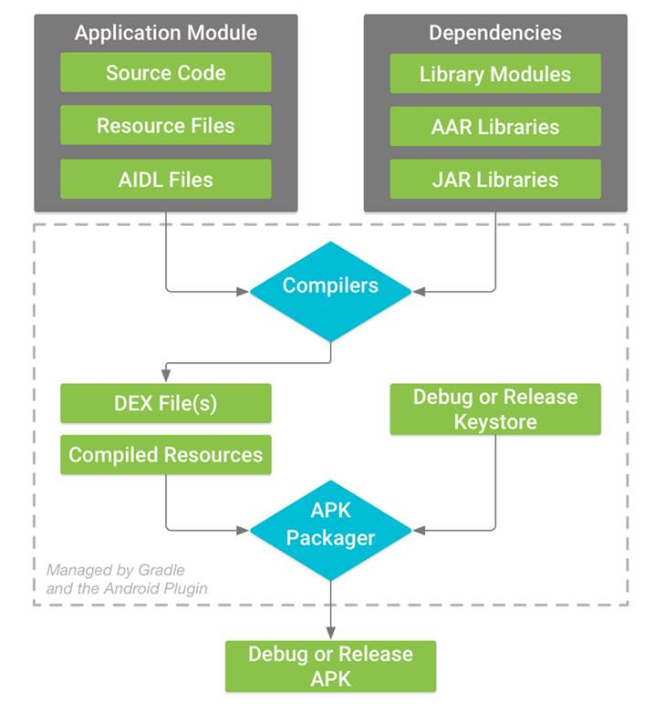
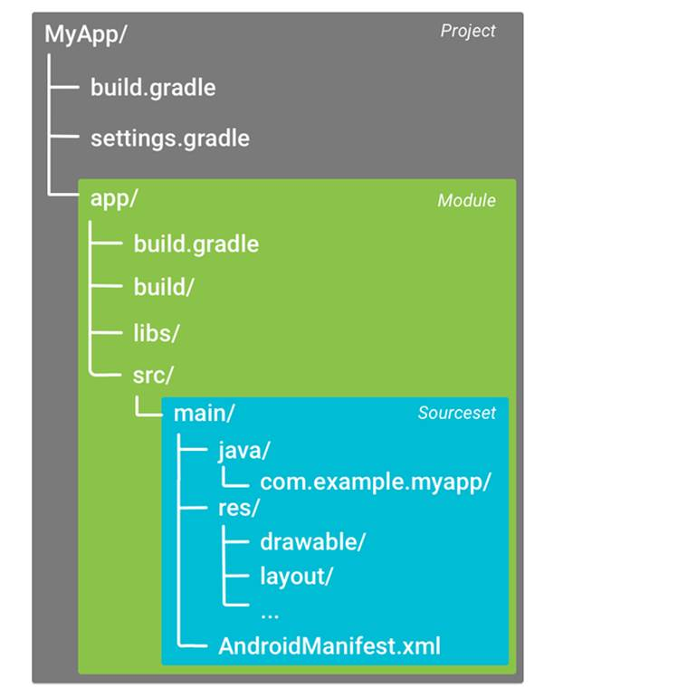

<!--
author:   Galina Rudolf

email:    Galina.Rudolf@informatik.tu-freiberg.de

version:  0.0.1

language: de


-->

# 1 Einführung
## 1.1 Systemaufbau

Android wurde als Plattform für mobile Geräte konzipiert und am Anfang nur für ARM-Prozessoren verfügbar. Meiste mobile Geräte verwenden auch heute diese Architektur. Weiterhin läuft Android auf MIPS und X86.

Schichten der Android-Architektur:

<!--style="width:50%"-->

Quelle: Universität Trier, Bernhard Baltes-Götz, Einführung in die Entwicklung von Apps für Android 8

**Basis: Linus-Kernel:**

Die Architektur von Android baute anfangs auf dem Linux-Kernel 2.6 auf, ab Android 4.x wird ein Kernel der 3.x-Serie verwendet. Er ist für die Speicherverwaltung und Prozessverwaltung zuständig und stellt die Schnittstelle zum Abspielen von Multimedia und der Netzwerkkommunikation dar. Außerdem bildet er die Hardware-Abstraktionsschicht für den Rest der Software und stellt die Gerätetreiber für das System. (s. auch [https://de.wikipedia.org/wiki/Android_(Betriebssystem)#Architektur])

**Android Laufzeitumgebung:**

Die Laufzeitumgebung beinhaltet im Wesentlichen Android-Runtime (ART) bzw. DVM (Dalvik Virtual Machine) bzw.  und C/C++Bibliotheken. Pro Anwendung wird unter Android ein Prozess gestartet, darin läuft VM (Virtual Machine).

Android-Laufzeitbibliotheken: sind C/C++ Bibliotheken, die folgende Funktionalität ermöglichen:
* Datenbank,
* 2-D, 3-D Grafik,
* Webzugriff,
* Multimedia-Verwaltung,
* UI-Komponenten etc

Konkrete Realisierungen:

* LibWebCore (Browsergrundlage)
* SQLite (Datenbank)
* Media Framework (Multimedia Subsystem OpenCore),
* SGL (2-D),
* OpenGl (3-D)

**Anwendungsrahmen (Android Application Framework):**

 bietet den Unterbau für die Anwendungen. Anwendungsrahmen beinhaltet Systemklassen, die den Zugriff auf Hardwarekomponenten aus Anwendungen ermöglichen und sind komplett in Java geschrieben (z.B. Activity Manager). Einige davon sind Bestandteil von Java SE, andere Android-spezifische stellt Android API zur Verfügung.

## 1.2 Dalvik Virtual Mashine / ART

* DVM wurde größtenteils vom Google-Mitarbeiter Dan Bornstein entwickelt (Dalvik - isländischer Ort) und
* basiert auf quelloffenen JVM Apache Harmory.
* DVM ist an Anforderungen mobiler Geräte angepasst, vor allem nutzt DVM die Mikroprozessoren Register anders als JVM aus.
* Dalvik wandelt den Dex-Bytecode einer Anwendung durch Just-in-time-Kompilierung in den nativen Befehlssatz des Prozessors um, welcher von der Laufzeitumgebung des Gerätes ausgeführt wird. Wegen Just-in-time-Kompilierung muss bei jedem Aufruf der Anwendung der Bytecode zunächst umgewandelt werden, was eine verzögerte Ausführung verursachte. ART wandelt dagegen den Dex-Bytecode einmalig während der Installation einer Anwendung mit Hilfe des dex2oat-Tools in nativen Binärcode um.

## 1.3 Build-Prozess
<!--style="width:50%"-->

Quelle: https://developer.android.com/studio/build

Die Abbildung gezeigt den Erstellungsprozess für ein typisches Android-App-Modul, der aus folgenden allgemeinen Schritten besteht:

1. Der Compiler übersetzt den Quellcode (.kt-, .java-Dateien) in Java-Bytecode (.class-Dateien) und alles andere in kompilierte Ressourcen.
2. Mit dem Programm **dx** wird Java-6-Bytecode in DVM-kompatibles Dalvik-Bytecode konvertiert (genannt Dex-Bytecode). Die Dateien bekommen die Namenserweiterung .dx. Dx-Tool ist Bestandteil von Android Development Kit. Der Prozess heißt **Cross-Compiling**.
3. Der APK Packager (Android Package Kit) kombiniert die DEX-Dateien und kompilierten Ressourcen in einem einzigen APK (.apk).
4. Bevor Ihre App (.apk) auf einem Android-Gerät installiert und bereitgestellt werden kann, muss die APK signiert sein. Der APK Packager signiert Ihre APK entweder über den Debug- oder den Release-Keystore:

     Wenn Sie eine Debug-Version Ihrer App erstellen, d.h. eine App, die Sie nur zum Testen verwenden möchten, signiert der Packager Ihre App mit dem Debug-Keystore. Android Studio konfiguriert neue Projekte automatisch mit einem Debug-Keystore.

    Wenn Sie eine Release-Version Ihrer App erstellen, die Sie extern veröffentlichen möchten, signiert der Packager Ihre App mit dem Release-Keystore (s. https://developer.android.com/studio/publish/app-signing#studio)

5. Vor dem Generieren Ihrer endgültigen APK verwendet der Packager das zipalign-Tool, um Ihre App so zu optimieren, dass auf einem Gerät weniger Speicher benötigt wird.

## 1.4 Android Studio und Gradle
Android Studio ist eine freie Integrierte Entwicklungsumgebung (IDE) von Google und offizielle Entwicklungsumgebung für die Android-Softwareentwicklung. Android Studio basiert auf der IntelliJ IDEA Community Edition.

Als Preview Version am 16. Mai 2013 angekündigt, existiert AS heute in der Version 3.6.1 (vom 28.2. 2020)

Seit der Android Studio Vorschau-Version 2.0 ist die Funktion Instant Run verfügbar, was es Entwicklern ermöglicht, geänderten Code und Ressourcen direkt auf dem Gerät innerhalb der laufenden App zu modifizieren.

Am 7. Mai 2019 ersetzte Kotlin Java als Googles bevorzugte Sprache für die Entwicklung von Android-Anwendungen. Java wird weiterhin unterstützt, ebenso C++.
Android Studio verwendet ein Build-Management-Automatisierungs-Tool Gradle.

Gradle nutzt eine auf Groovy (Programmier- und Scriptsprache) basierte anwendungsspezifische dynamische Sprache zur Beschreibung der Projekte für JVM. Gradle-Scripte (.gladle Dateien) enthalten einen direkt ausführbaren Code.

Beim Erzeugen des Projektes erstellt Android Studio automatisch gradle (und andere) Dateien, basierend auf Standardeinstellungen (s. Abbildung). Die tieferen Kenntnisse über die gradle-Dateien (Groovy) sind damit nicht erforderlich.

<!--style="width:50%"-->

Abbildung: Default Projektstruktur einer Android App
Quelle: https://developer.android.com/studio/build

**Gradle-Build**

Build kennt zwei Hauptphasen: Konfiguration und Ausführung. In der Konfigurationsphase wird Abhängigkeitsgraph erzeugt, der die Reihenfolge abzuarbeitenden Schritte (Tasks), die hierarchisch voneinander abhängen, enthält.

Build-Dateien:
* build.gradle - Definition des Builds mit allen Tasks und Abhängigkeiten eines Projekts (eines Moduls)
* settings.grandle (optional) - bei einem Multiprojekt werden hier die teilnehmenden Unterprojekte festgelegt
* grandle.properties (optional) - eine Liste von Properties, die für die projektspezifische Gradle-Initialisierung eines Builds gültig sind

In build.gradle von App:

werden die Repositories und Abhängigkeiten für Gradle selbst (Block Buildscript) und die, die alle Module des Projektes betreffen (Block allprojects), z.B. Plugins von Drittanbietern und Bibliotheken, konfiguriert.

In build.gradle auf Modulebene, die sich in jedem Projektmodul Verzeichnis befindet, werden die Build-Einstellungen für das jeweilige Modul konfiguriert: benutzerdefinierte Paketoptionen, z.B. zusätzliche Build-Typen bereitstellen, und ggf. die Einstellungen im App-Manifest oder in der build.gradle-Datei der obersten Ebene überschrieben.

Mit den zusätzlichen Einträgen im Abschnitt dependencies wird z.B. die Nutzung von androidx.preference (hier mit Kotlin) ermöglicht.

```
dependencies {
...
implementation 'androidx.preference:preference-ktx:1.1.0'
implementation 'androidx.legacy:legacy-preference-v14:1.0.0'
...
}
```

## 1.5 Android-Komponenten
Android Apps bestehen meistens aus mehreren Komponenten. Davon gibt es 4 Arten. Eine Komponente wird als Programmeintrittskomponente festgelegt und kann andere Komponenten starten. Android Anwendungen sind "offen", d.h. sie erlauben über das Berechtigungssystem anderen Anwendungen ihre eigenen Komponenten zu starten.

* Activity (View)
  Eine Activity (dt.: Aktivität) präsentiert eine Bildschirmseite mit Bedienelementen. Beim App-Start erscheint die Haupt- oder Startaktivität. In der Regel enthält eine App mehrere Aktivitäten, zwischen denen der Benutzer wechseln kann.

* Service (Controller)
  Ein Service (dt.: Dienst) führt länger laufende Aufgaben im Hintergrund aus und hat keine Bedienoberfläche. Er kann von einer anderen Anwendungskomponente (von einer Activity, von einem Broadcast Receiver oder von einem anderen Service) gestartet werden (über die Methode startService()), um eine einzelne Aufgabe auszuführen. In diesem Fall beendet sich der Dienst in der Regel selbst, sobald seine Aufgabe (z. B. ein Download oder eine Synchronisation) erledigt ist. Ein gestarteter Dienst läuft weiter, wenn der Benutzer zu einer anderen Aktivität wechselt. In der Regel findet nach dem Start keine weitere Steuerung durch den Initiator statt. Statt einen Dienst zu starten, kann sich eine Anwendungskomponente an einen Dienst binden (über die Methode bindService()), um anschließend mit ihm zu interagieren (z. B. zur Steuerung einer Musikwiedergabe). Ein gebundener Dienst kann auch mehreren Klienten dienen und endet mit der letzten Bindung.

* Broadcast Receiver (Empfangen von Systemnachrichten)
  Ein Broadcast Receiver (dt.: Rundrufempfänger) kann auf Nachrichten reagieren, die vom System oder von Anwendungen stammen (z. B. niedriger Akkuladezustand, WLAN-Verbindung hergestellt, Flugmodus beendet). Er hat keine eigene Bedienoberfläche und darf nur kurzzeitig aktiv werden, kann aber Aktivitäten oder Dienste starten.

* Content Provider
  Content Provider verwaltet Daten, abstrahiert darunterliegende Schicht. Er kann über (kontrollierte) Berechtigungen die Daten anderen Anwendungen zur Verfügung stellen.
  Denn während unter Windows jede Anwendung mit den Zugriffrechten des angemeldeten Benutzers arbeitet, schottet Android die Anwendungen untereinander ab, sodass eine App nicht auf die von einer anderen App verwalteten Daten zugreifen kann.

## 1.6 Das erste Projekt
Zum Erstellen des Projekts verwenden wir hier Android Studio. Das Projekt enthält nur eine Empty Activity, d.h. eine Aktivität die als erste gestartet wird und nur eine Ausgabe, "Hello World"-Zeichenkette enthält.

Hier werden kurz die wesentlichen Bestandteile der App, die automatisch erstellt werden, angesprochen:

Eine Kotlin-Klasse: MainActivity.kt

```
package de.xxx.erstesbeispiel

import androidx.appcompat.app.AppCompatActivity
import android.os.Bundle

class MainActivity : AppCompatActivity() {
    override fun onCreate(savedInstanceState: Bundle?) {
        super.onCreate(savedInstanceState)
        setContentView(R.layout.activity_main)
    }
}
```

Die Klasse wird von der Klasse AppCompatActivity abgeleitet und erbt somit die Methode onCreate, die überschrieben werden muss. Die Methode onCreate enthält als Parameter das Objekt der Klasse Bundle, das zuvor gespeichertes Zustand der Aktivität zur Wiederherstellung enthält.
In der Methode wird in diesem Beispiel die in XML-Layout-Datei definierte Benutzeroberfläche geladen indem die Ressourcen-ID R.layout.activity_main an die Methode setContentView () übergeben wird.

App Ressourcen:

Ressourcen sind aus dem Quellcode ausgelagerte statische Inhalte, z.B. Layout-Definitionen, Strings für Benutzeroberflächen. Auf App Ressourcen wird aus dem Quellcode mit Hilfe von Ressourcen-IDs zugegriffen.

Diese activity_main.xml beschreibt die Layout-Ressourcen und enthält die Festlegungen zur Benutzeroberfläche.

activity_main.xml

```
<?xml version="1.0" encoding="utf-8"?>
<androidx.constraintlayout.widget.ConstraintLayout xmlns:android="http://schemas.android.com/apk/res/android"
    xmlns:app="http://schemas.android.com/apk/res-auto"
    xmlns:tools="http://schemas.android.com/tools"
    android:layout_width="match_parent"
    android:layout_height="match_parent"
    tools:context=".MainActivity">

    <TextView
        android:layout_width="wrap_content"
        android:layout_height="wrap_content"
        android:text="Hello World!"
        app:layout_constraintBottom_toBottomOf="parent"
        app:layout_constraintLeft_toLeftOf="parent"
        app:layout_constraintRight_toRightOf="parent"
        app:layout_constraintTop_toTopOf="parent" />
</androidx.constraintlayout.widget.ConstraintLayout>
```

Die string.xml Datei enthält die Textressourcen, hier nur App Name

strings.xml

```
<resources>
    <string name="app_name">ErstesBeispiel</string>
</resources>
```

Android Manifest:

Die Komponenten einer Android-App müssen in AndroidManifest.xml deklariert werden. über intent-filter wird eine Aktivität zur Start-Aktivität erklärt.

AndroidManifest.xml

```
<?xml version="1.0" encoding="utf-8"?>
<manifest xmlns:android="http://schemas.android.com/apk/res/android"
    package="de.xxx.erstesbeispiel">

    <application
        android:allowBackup="true"
        android:icon="@mipmap/ic_launcher"
        android:label="@string/app_name"
        android:roundIcon="@mipmap/ic_launcher_round"
        android:supportsRtl="true"
        android:theme="@style/AppTheme">
        <activity android:name=".MainActivity">
            <intent-filter>
                <action android:name="android.intent.action.MAIN" />
                <category android:name="android.intent.category.LAUNCHER" />
            </intent-filter>
        </activity>
    </application>

</manifest>
```


## 1.7 Das Logging-System von Android
Das Verhalten einer Anwendung kann mit Hilfe der sogenannten **Log**-Meldungen überwacht werden. Dieses Vorgehen wird als Logging bezeichnet. Die Meldungen werden vom **Logger-Framework** (**Logging**-System) während der Ausführung einer App auf dem physikalischen oder virtuellen Android Gerät ausgegeben.

Für das Auslesen der Ringpuffer der Android Geräte ist das Tool logcat verantwortlich.

Da Logcat in Android Studio fest integriert ist, können Log-Meldungen komfortabel innerhalb der Entwicklungsumgebung betrachtet werden.

Standardmäßig werden über logcat sämtliche Log-Meldungen der drei Default-Ringpuffer des angeschlossenen Android Geräts ausgegeben. In dieser Flut an Ereignismeldungen geht natürlich schnell die übersicht verloren, darum sollen sie sinnvollerweise gefiltert werden.

Ein Filterausdruck besitzt folgendes Format: **TAG:Prioritätsstufe**

Prioritätsstufen sind wie folgt definiert:
* V: Verbose (niedrigste Priorität)
* D: Debug
* I: Info
* W: Warning
* E: Error
* F: Fatal
* S: Silent (höchste Priorität, hier wird niemals etwas ausgegeben)

Für das Ausgeben von eigenen Log-Meldungen stellt das Android Framework die Klasse Log zur Verfügung. Mit Hilfe dieser Klasse können Log-Meldungen aus dem Quellcode ausgegeben und anschließend in logcat betrachtet werden.

Die Ausgabe erfolgt mittels fünf statischen Methoden:
* Log.v(String, String) - für ausfhrliches (verbose) Protokollieren während der Entwicklungsphase.
* Log.d(String, String) - ist für die Ausgabe von Debug-Informationen (debug) vorgesehen.
* Log.i(String, String) - für wichtige Statusinformationen (information). Nur spärlich zu verwenden.
* Log.w(String, String) - für Warnungen (warning) über den Zustand der App.
* Log.e(String, String) - aufgetretene Fehler (error) werden hiermit gemeldet.

Beispiel:

```
val logTag = MainActivity::class.java.simpleName
Log.v(logTag, "Verbose - Meldung.")
```
*Wie geht es weiter:*
* *Wie die erste App mit Android Studio erstellt, ausgeführt und einige kleine Veränderungen vorgenommen wird in der Aufgabe 1 und in der Datei AndroidStudio-ersteSchritte beschrieben.*
* *Weiter geht es mit Grundlagen der Programmiersprache Kotlin.*
