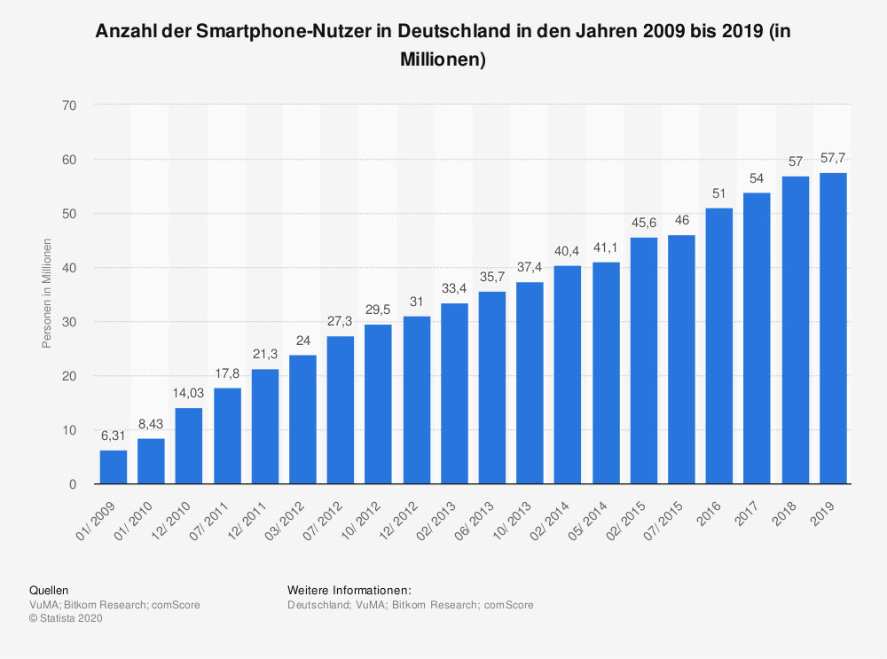
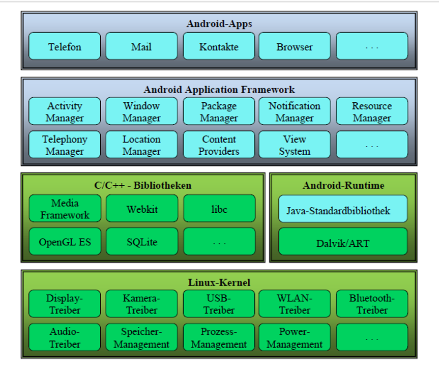
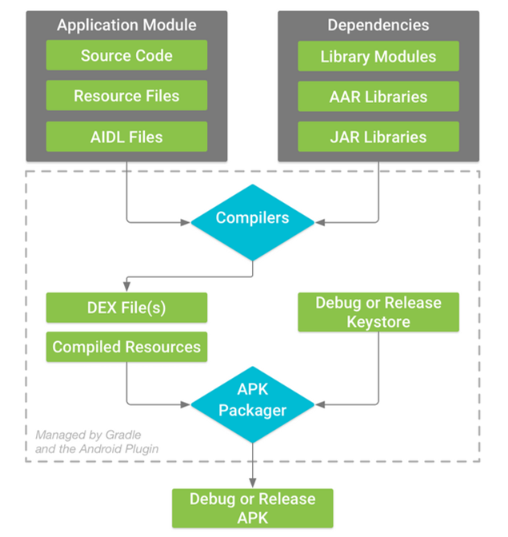
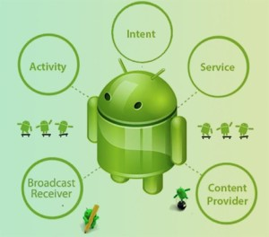

<!--
author:   Galina Rudolf

email:    galina.rudolf@informatik.tu-freiberg.de

logo:     https://upload.wikimedia.org/wikipedia/commons/c/cb/Kotlin_vs_java.jpg
version:  0.0.1

language: de

narrator: Deutsch Female

comment:  Beispiel eines Foliensatzes mit
          Verwendung von LiaScript.

translation: Deutsch  translations/German.md
-->

# **<font color=red>Android meets Kotlin (oder Android mit Kotlin)</font>**

## Motivation

### Gibt es eine Welt ohne Smartphone?
{{1-2}}
<!--style="width:75%"-->

{{1-2}}
[Quelle: rawpixel.com](https://www.rawpixel.com)

{{2}}
Vielleicht ein besserer Beweis:

{{2}}
<!--style="width:75%"-->

{{2}}
[Quelle: Statista](https://de.statista.com/statistik/daten/studie/198959/umfrage/anzahl-der-smartphonenutzer-in-deutschland-seit-2010/)

### Warum Android?

+ Betriebssystem für mobile Geräte wie Smartphones, Netbooks …

  > Wikipedia: Android hatte als Smartphone-Betriebssystem im dritten Quartal 2016
  > einen weltweiten Marktanteil von 87,5 Prozent (nach Verkaufszahlen).

+ und Software-Plattform , d.h. erlaubt die Entwicklung von Anwendungen


     {{1}}
Entwicklungssprachen: Java und Kotlin

     {{2-3}}
*Java und Kotlin sind beide <font color=red size=5>Inseln</font>.*

     {{2-3}}
<!--style="width:75%" -->

     {{3}}
**Java und Kotlin sind beide moderne platformübergreifende objektorientierte <font color=red size=5>Programmiersprachen</font>.**

### Warum mit Kotlin?

+ eine plattformübergreifende  Programmiersprache
+ kann in Bytecode für die Java Virtual Machine (JVM) übersetzt werden, aber
  nicht nur
+ lässt sich zur Entwicklung von Android-Apps verwenden und wird seit 2017
  offiziell von Google unterstützt, seit 2019 empfohlene Programmiersprache
+ Eine moderne Programmiersprache mit interessanten Konzepten
+ syntaktisch nicht zu Java kompatibel, kann aber mit Java-Code interoperieren
+ nutzt Java Class Library (JCL)


## Mehr über Android

### Android-Architektur
<!--style="width:75%"-->

Quelle: Universität Trier, Bernhard Baltes-Götz, Einführung in die Entwicklung
von Apps für Android 8

     {{1-2}}
Anwendungsrahmen (Android Application Framework)

     {{2-3}}
Android Laufzeitumgebung

     {{3}}
Basis: Linus-Kernel

### Build-Prozess

Warum wir Java und Kotlin kombinieren können … und Bytecode ist nur der erste Schritt…

<div>

<!--
style=" width: 30%;
        float: right;"
-->
````ascii
+----------------------------+
|   .java                    |
|   .kt                      |
+-------------+--------------+
              |
              V
.----------------------------.
|   Compiler                 |
'-------------+--------------'
              |
              v
+----------------------------+
|   .class                   |
+-------------+--------------+
              |
              v
.----------------------------.
|    dx                      |
'-------------+--------------'
              |
              v
+----------------------------+
|   .dex                     |
+-------------+--------------+
              |
              v
.----------------------------.
|   apk                      |
'-------------+--------------'
              |
              v
+----------------------------+
|   .apk                     |
+----------------------------+
````
<!--style="width:60%"-->

[Quelle: https://developer.android.com/studio/build](https://developer.android.com/studio/build)

</div>


### Was ist eine Komponente welche und wie viele gibt es in einer App?

<!--style="width:60%"-->

[Quelle: https://www.edumobile.org](https://www.edumobile.org)

    {{1-2}}
**Activity (Aktivität):** präsentiert eine Bildschirmseite mit Bedienelementen.  

    {{2-3}}
**Service (Dienst):** führt Aufgaben im Hintergrund aus und hat keine Bedienoberfläche. Er kann von einer anderen Anwendungskomponente gestartet oder gebunden werden

    {{3-4}}
**Broadcast Receiver (Empfangen von Nachrichten):** kann auf Nachrichten reagieren, die vom System oder von Anwendungen stammen . Er hat keine Benutzeroberfläche und ist nur kurzzeitig aktiv, kann aber Aktivitäten oder Dienste starten.

    {{4-5}}
**Content Provider:** verwaltet Daten, abstrahiert darunterliegende Schicht (z. B. eine Datenbank). Er kann über erteilte Berechtigungen die Daten anderen Anwendungen zur Verfügung stellen.

    {{5}}
und über Intents sprechen wir später

## Literatur
https://developer.android.com/guide/

https://developer.android.com/kotlin/

https://de.wikipedia.org/wiki/Kotlin_(Programmiersprache)

http://helmbold.de/artikel/kotlin/

http://helmbold.de/artikel/java-kotlin/

https://developer.android.com/kotlin/

## Ausserhalb des Tellerrandes
### Boolesche Funktion

> Eine Boolesche Funktion (auch logische Funktion) ist eine mathematische Funktion
> der Form $F : B^n → B^1$. $B$ ist dabei eine Boolesche Algebra.

#### Formen von Booleschen Funktionen

**DNF**:
$$
f(\underline x)=\bar x_0 x_1 x_2 \vee  x_0 \bar x_1 x_2 \vee  x_0 x_1 \bar x_2
$$
**ANF:**
$$
f(\underline x)=\bar x_0 x_1 x_2 \oplus  x_0 \bar x_1 x_2 \oplus  x_0 x_1 \bar x_2
$$
**KNF:**
$$
f(\underline x)=(x_0 \vee x_1 \vee x_2) \wedge  (x_0 \vee x_1 \vee \bar x_2) \wedge ( x_0 \vee \bar x_1 \vee x_2) \wedge
(\bar x_0 \vee x_1 \vee x_2) \wedge (\bar x_0 \vee  \bar x_1 \vee \bar x_2)
$$

Und das wäre eine ganz andere Formel ;-):
$$
   \sum_{i=1}^\infty\frac{1}{n^2}
        =\frac{\pi^2}{6}
$$


#### Darstellungsformen einer Booleschen Funktion

+ Ausdruck
+ Karnaugh-Diagramm

<!--style="color: red"-->Beispiel:

Formel vertikal mittig ausrichten?

<div>
<!--
style=" width: 49%;
        float: right;"
-->
````ascii
c                   f
  +---+---+---+---+
0 | 0 | 1 | 1 | 1 |
  +---+---+---+---+
1 | 1 | 0 | 1 | 1 |
  +---+---+---+---+
    0   1   1   0   b
    0   0   1   1   a
````
<!--
style=" width: 49%;
        float: left;"
-->
$$
f_1(a,b,c)=a \vee  (b \oplus c)=a \vee \bar b c\vee b \bar c
$$
</div>

### Chemische Formeln

+ Verhältnisformel
+ Summenformel
+ Strukturformel
+ Kristallchemische Strukturformel

Beispiele:

<!--
style=" width: 30%;
        float: right;"
-->
````ascii
    H
    |
H - C - H
    |
    H
````

$$CH_4$$


## Markdown

You can use common [Markdown](https://github.com/adam-p/markdown-here/wiki/Markdown-Cheatsheet) syntax to create your course, such as:

1. Lists
2. ordered or

   * unordered
   * ones ...


| Header 1   | Header 2   |
| :--------- | :--------- |
| Item 1     | Item 2     |


Images:


### Extensions

     --{{0}}--
But you can also include other features such as spoken text.

      --{{1}}--
Insert any kind of audio file:

       {{1}}
?[audio](https://bigsoundbank.com/UPLOAD/mp3/1068.mp3)


     --{{2}}--
Even videos or change the language completely.

       {{2-3}}
!?[video](https://www.youtube.com/embed/bICfKRyKTwE)


      --{{3 Russian Female}}--
Первоначально создан в 2004 году Джоном Грубером (англ. John Gruber) и Аароном
Шварцем. Многие идеи языка были позаимствованы из существующих соглашений по
разметке текста в электронных письмах...


    {{3}}
Type "voice" to see a list of all available languages.


### Styling

<!-- class = "animated rollIn" style = "animation-delay: 2s; color: purple" -->
The whole text-block should appear in purple color and with a wobbling effect.
Which is a **bad** example, please use it with caution ...
~~ only this is red ;-) ~~ <!-- class = "animated infinite bounce" style = "color: red;" -->

## Charts

Use ASCII-Art to draw diagrams:

                                    Multiline
    1.9 |    DOTS
        |                 ***
      y |               *     *
      - | r r r r r r r*r r r r*r r r r r r r
      a |             *         *
      x |            *           *
      i | B B B B B * B B B B B B * B B B B B
      s |         *                 *
        | *  * *                       * *  *
     -1 +------------------------------------
        0              x-axis               1

## Quizzes

### A Textquiz

What did the **fish** say when he hit a **concrete wall**?

    [[dam]]

### Multiple Choice

Just add as many points as you wish:

    [[X]] Only the **X** marks the correct point.
    [[ ]] Empty ones are wrong.
    [[X]] ...

### Single Choice

Just add as many points as you wish:

    [( )] ...
    [(X)] <-- Only the **X** is allowed.
    [( )] ...

## Executable Code

A drawing example, for demonstrating that any JavaScript library can be used, also for drawing.

```javascript
// Initialize a Line chart in the container with the ID chart1
new Chartist.Line('#chart1', {
  labels: [1, 2, 3, 4],
  series: [[100, 120, 180, 200]]
});

// Initialize a Line chart in the container with the ID chart2
new Chartist.Bar('#chart2', {
  labels: [1, 2, 3, 4],
  series: [[5, 2, 8, 3]]
});
```
<script>@input</script>

<div class="ct-chart ct-golden-section" id="chart1"></div>
<div class="ct-chart ct-golden-section" id="chart2"></div>


### Projects

You can make your code executable and define projects:

``` js     -EvalScript.js
let who = data.first_name + " " + data.last_name;

if(data.online) {
  who + " is online"; }
else {
  who + " is NOT online"; }
```
``` json    +Data.json
{
  "first_name" :  "Sammy",
  "last_name"  :  "Shark",
  "online"     :  true
}
```
<script>
  // insert the JSON dataset into the local variable data
  let data = @input(1);

  // eval the script that uses this dataset
  eval(`@input(0)`);
</script>

## More

Find out what you can even do more with quizzes:

https://liascript.github.io/course/?https://raw.githubusercontent.com/liaScript/docs/master/README.md
